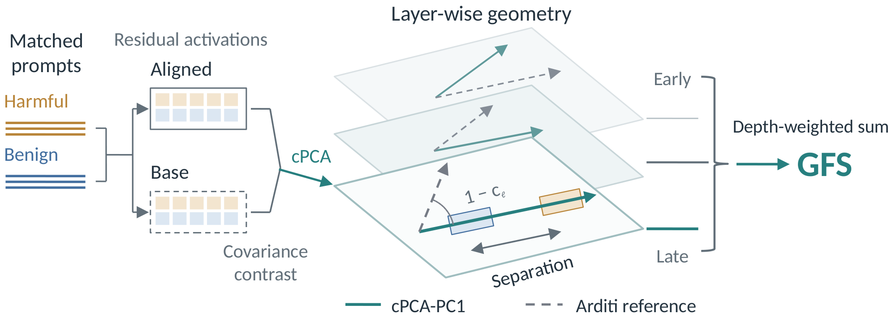

<div align="center">

# 🩹 Skin-Deep

### A Geometric Diagnostic for Alignment Fragility in LLM Representations

[](https://2026.aaclnet.org/)
[](https://arxiv.org/abs/2606.22676)
[](LICENSE)
[](https://arxiv.org/abs/2606.22676)
[](https://www.python.org/)
[](https://github.com/js-lee-AI/skin-deep/stargazers)



<b>Official implementation of the <a href="https://2026.aaclnet.org/">Findings of AACL-IJCNLP 2026</a> paper.</b>

<em>Reading alignment fragility straight from an aligned model's hidden states, <b>before</b> any prompt- or weight-level attack is run.</em>

<b><a href="https://arxiv.org/abs/2606.22676">📄 Paper</a> · <a href="#overview">✨ Overview</a> · <a href="#installation">⚙️ Installation</a> · <a href="#usage">🚀 Usage</a> · <a href="#key-results">📊 Results</a> · <a href="#citation">📌 Citation</a></b>

</div>

---

## News

- **2026-10** · The camera-ready version is on [arXiv](https://arxiv.org/abs/2606.22676) (v2).
- **2026-09** · Accepted to **Findings of AACL-IJCNLP 2026**.
- **2026-06** · Paper released on [arXiv](https://arxiv.org/abs/2606.22676), and the pre-attack diagnostic pipeline is public here.

## Overview

**Skin-Deep** is the reference implementation of the **Geometric Fragility Score (GFS)**, a *pre-attack* diagnostic that reads alignment fragility directly from an aligned model's hidden-state activations, **before** any prompt- or weight-level attack is run.

Across twenty-one instruction-tuned models, harmful requests and benign instructions exhibit a recurring low-rank separation pattern, and selected direction ablations weaken refusal. In benign low-rank fine-tuning experiments, the initially safe model with the lowest score before fine-tuning has the lowest harmful-compliance rate when trained on the largest tested set of harmless examples.

> Paper: *Skin-Deep: A Geometric Diagnostic for Alignment Fragility in Large Language Model Representations.*

## What this repository contains

A self-contained pipeline for the **pre-attack** analyses in the paper:

| Script | Paper claim | What it does |
| --- | --- | --- |
| `extract_hidden_states.py` | - | Extract last-token, all-layer activations from an aligned model and its version-matched base model (raw prompts, or `--chat_template`). |
| `analyze_subspace.py` | C1 (subspace) | Per-layer contrastive-PCA direction, Cohen's *d*, PERMANOVA, RBF-MMD, with BH-FDR correction. |
| `compute_gfs.py` | C4 (diagnostic) | Compute the Geometric Fragility Score and per-layer profiles. |
| `common_utils.py` | - | Shared library (extraction, cPCA, Cohen's *d*, MMD, PERMANOVA, BH-FDR). |

### Responsible release

Consistent with the paper's **Ethics Statement**, this repository releases only the **pre-attack diagnostic** pipeline. The following attack-side artifacts are **deliberately withheld** and are *not* part of this repository:

1. generation-time direction-ablation hooks;
2. attack-ready direction-extraction scripts;
3. the LoRA adapter weights used for the behavioral tests.

GFS is intended as a **defensive** tool: flagging fragile refusal behavior in a checkpoint *before* release. Please use it accordingly.

## Installation

```bash
pip install -r requirements.txt
```

Gated checkpoints (e.g. Llama, Gemma) require authentication:

```bash
huggingface-cli login
```

## Data

Prepare two JSONL prompt files (a harmful-request "safe" set and a benign "general" set) as described in [`data/README.md`](data/README.md). The source datasets are not redistributed here.

## Usage

**1. Extract activations** for an aligned model and its version-matched base:

```bash
python skin_deep/extract_hidden_states.py \
    --instruct_model meta-llama/Llama-3.1-8B-Instruct \
    --base_model     meta-llama/Llama-3.1-8B \
    --safe_prompts    data/safe.jsonl \
    --general_prompts data/general.jsonl \
    --output results/llama/hidden_states.npz
```

Repeat for each model into `results/<model>/hidden_states.npz` (e.g. `llama`, `qwen`, `mistral`, `gemma`).

By default prompts are passed **raw** (no chat template), the path used by the GFS ranking. To reproduce the **chat-template robustness** analyses, add `--chat_template` (and a larger `--max_length`, e.g. `256`); each prompt is then wrapped as a single user turn with the instruct tokenizer's `apply_chat_template` (`add_generation_prompt=True`) before extraction.

**2. Subspace analysis (Claim 1):**

```bash
python skin_deep/analyze_subspace.py \
    --results_dir results --output_dir results/subspace \
    --models llama,qwen,mistral,gemma
```

**3. Geometric Fragility Score (Claim 4):**

```bash
python skin_deep/compute_gfs.py \
    --results_dir results --output_dir results/gfs \
    --models llama,qwen,mistral,gemma
```

This writes `gfs_results.json` and `gfs_analysis.png` (GFS bar chart plus per-layer Cohen's *d* and PC1-Arditi cosine profiles).

## Repository structure

```
skin_deep/
  common_utils.py          # shared library
  extract_hidden_states.py # step 1: activation extraction
  analyze_subspace.py      # step 2: cPCA subspace + full-space tests (C1)
  compute_gfs.py           # step 3: Geometric Fragility Score (C4)
data/
  README.md                # how to assemble the prompt sets
requirements.txt
LICENSE
```

## Key results

Skin-Deep is a diagnostic, not a task model, so there is no accuracy-vs-baseline table. Its main empirical findings, across 21 instruction-tuned models (3B–32B):

- **Separation.** Harmful requests and benign instructions separate along a small set of directions. In split-sample checks, directions fitted on one prompt subset also separate the held-out prompts, with held-out Cohen's *d* of 3.23, 2.97, 2.71, and 2.88 for Llama-3.1-8B, Qwen-2.5-7B, Mistral-7B-v0.3, and Gemma-2-9B, and a minimum of 1.69 across a fourteen-model check. PERMANOVA remains significant after correction for all core models, and unit-normalized PCA also retains the separation.
- **Behavioral relevance.** Removing a selected PCA, contrastive PCA, or reference refusal direction during generation gives a detectable refusal decrease for at least one tested direction in four of the six ablation models. The effective direction varies by model, and random-direction rates remain close to the baselines.
- **Recurrence.** The core families preserve similar activation relationships among matched prompts. Every pair's peak-layer CKA exceeds the prompt-shuffle null, while the strongest separation occurs at different depths.
- **Diagnostic association (GFS).** Computed before any fine-tuning, GFS is lowest for Gemma-2-9B among the initially safe models of the LoRA cohort, and Gemma-2-9B also has the lowest harmful-compliance rate after benign LoRA on the largest tested set (n=200). Every non-Gemma core run reaches full compliance (1.00), while Gemma's mean is 0.68. This is an endpoint association within one harmless-data protocol and a small cohort, not a calibrated forecast.

## Citation

```bibtex
@article{lee2026skin,
  title={Skin-Deep: A Geometric Diagnostic for Alignment Fragility in Large Language Model Representations},
  author={Lee, Dongyub Jude and Lee, Jungseob and Lee, Seungyoon and Hong, Seongtae and Son, Suhyune and Eo, Sugyeong and Seo, Jaehyung and Lim, Heuiseok},
  journal={arXiv preprint arXiv:2606.22676},
  year={2026}
}
```

## License

The code in this repository is released under the [MIT License](LICENSE). The paper itself is distributed under CC BY 4.0 via arXiv.
